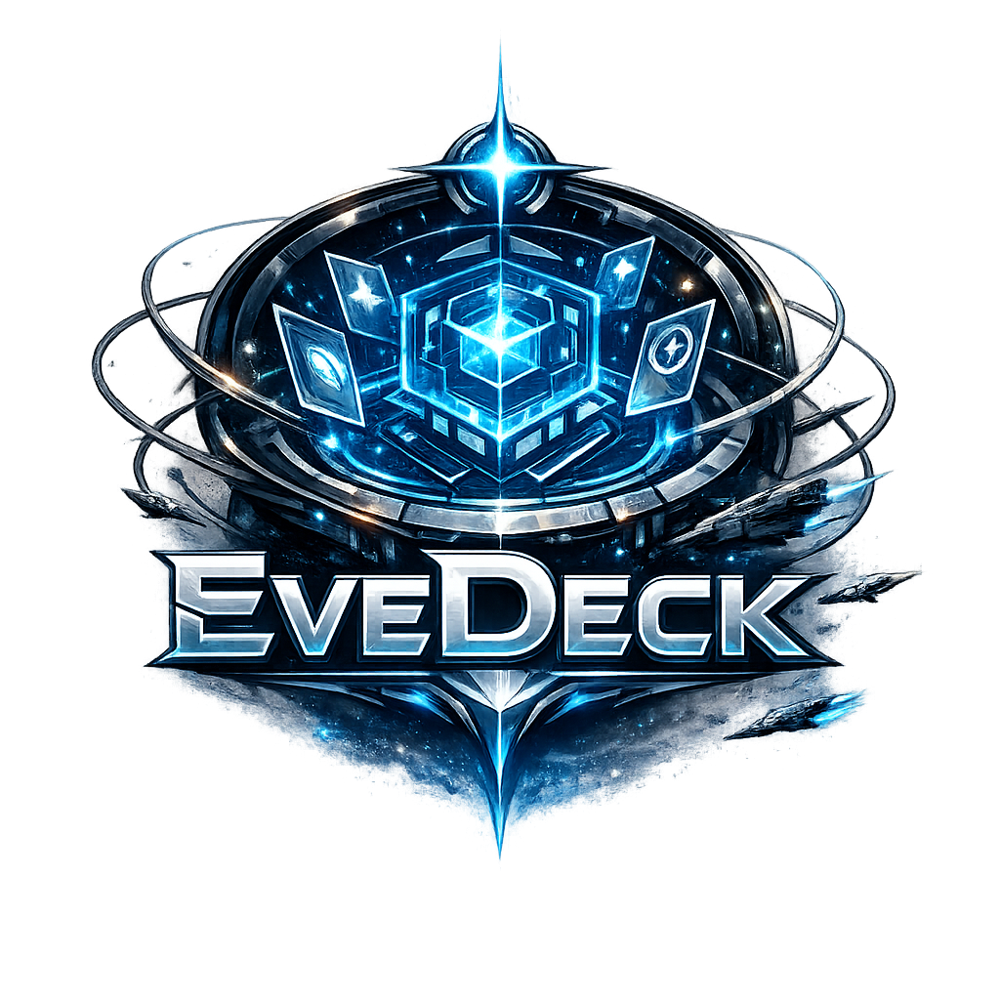

<div align="center">



# EveDeck

### Command your fleet. One window at a time.

**A free, EULA-safe window layout &amp; focus manager for EVE Online multiboxing.**<br />
Live GPU-quality previews, hotkey focus switching, and resolution-independent layout
profiles — all from a single self-contained Windows app.

[](https://github.com/objectless/EveDeck/releases/latest)
[](https://evedeck.space)
[](LICENSE)


**[⬇ Download](https://github.com/objectless/EveDeck/releases/latest)  ·  [🌐 evedeck.space](https://evedeck.space)  ·  [📖 Setup guide](https://evedeck.space/readme)**

</div>

---

## Why EveDeck?

Multiboxing EVE means wrangling a wall of clients. EveDeck arranges them into
pixel-perfect layouts, shows live previews of every background client, and lets you
throw focus to any character with a single keypress — while staying strictly inside the
EVE Online EULA. **It is a window manager only. One input, one client, always.**

## Everything you need for multiboxing

🪟 **Previews &amp; peek** — high-quality Windows.Graphics.Capture (D3D11) thumbnails of your
background clients, right in their layout tiles. Hover to *peek* a client into the master
slot; click to swap. It reverts the moment your cursor leaves.

📐 **Layout profiles** — built-in families with resolution and account-count dropdowns:
**Grid**, **Center Master**, **Whammy Board**, **Side Stack**, **Stacked / 1-Char /
Overlap** — plus fully custom profiles. An on-monitor WYSIWYG editor lets you drag slots
to move, drag edges to resize, and snap to the grid. What you draw is exactly what you get.

🧑‍🚀 **Character identity &amp; ESI** — character names and portraits via EVE SSO (PKCE
OAuth). Fixed seats (*Model A*): accounts keep their seat and labels never scramble —
window positions rotate, identities don't. No passwords, ever.

⌨️ **Hotkeys &amp; focus control** — global hotkeys to centre any seat, swap with the
master, focus by screen direction, or follow a named character wherever they've rotated to.
Gated mode fires keys only while EVE is the active app.

🖥️ **Desktop &amp; system** — borderless toggling, active-window frame glow, tray mode,
auto-apply on client launch, per-profile taskbar avoidance, and full multi-monitor support.

📋 **Resolution independent** — layout slots are stored as fractional rects, so one profile
works at 1440p, 4K, or any AMD VSR / Nvidia DSR virtual resolution, with an optional
master-resolution override. EVE clients are never resized mid-session, so the in-game UI
never re-flows.

## Up and running in minutes

**01 · Download &amp; run** — grab the [latest release](https://github.com/objectless/EveDeck/releases/latest),
unzip, and run `EveDeck.exe`. No installer, no .NET runtime — everything is bundled.

**02 · Complete the wizard** — it detects your clients, links your characters via ESI
OAuth, and picks a layout preset. Under two minutes, start to finish.

**03 · Apply &amp; multibox** — click **Apply Layout**. Your clients snap into place and
previews appear instantly. Hover to peek, click to swap, or drive your whole fleet from
the keyboard.

> **Heads up:** if EVE runs as Administrator, run EveDeck as Administrator too — otherwise
> its global hotkeys can't reach the game.

## EULA compliance

EveDeck is built to comply with the EVE Online EULA's one-input-one-client rule. It
contains **no** input broadcasting or multiplexing, no key/mouse forwarding, no gameplay
or login automation, no game-memory access, and no password storage. Every hotkey action
passes a safety guard that blocks input-forwarding behaviour by construction. See
[app/COMPLIANCE.md](app/COMPLIANCE.md) for the full boundary.

## FAQ

**Is EveDeck allowed under the EVE Online EULA?**
Yes. EveDeck only moves and styles OS windows — it never reads EVE memory, injects code,
broadcasts input across clients, or automates gameplay. One human input always controls
one client at a time.

**Do I need to install .NET or any runtime?**
No. The download is a single self-contained build; everything EveDeck needs is bundled
inside. Just extract and run.

**Does it work with multiple monitors?**
Yes. Run clients across displays and assign them to slots; each profile stores its target
monitor and scales to that monitor at apply time.

**Does it support AMD VSR / Nvidia DSR virtual resolutions?**
Yes. Slots are stored as fractional rects, so a single profile works at any resolution,
with a per-profile master-resolution override for DSR setups.

**My hotkeys aren't firing — what do I check?**
If EVE is running as Administrator, EveDeck must be too. Also make sure gated mode is
enabled on the Hotkeys tab so keys fire only when EVE is active.

## Building from source

Requirements: Windows 10 (build 19041+) and the .NET 10 SDK.

```powershell
dotnet build .\app\EveDeck.sln          # build
dotnet test  .\app\EveDeck.sln          # run the test suite

# self-contained publish (what releases ship)
dotnet publish .\app\src\EveDeck\EveDeck.csproj `
  -c Release --self-contained -r win-x64 -o .\app\publish
```

## License

EveDeck is free software under the **GNU General Public License v3.0** — see
[LICENSE](LICENSE). Copyright © 2026 EveDeck.

The **EveDeck name, logo, and icon are not covered by the GPL** and remain the exclusive
property of the EveDeck project — forks must ship under their own branding. See
[TRADEMARKS.md](TRADEMARKS.md).

EVE Online is a trademark of [CCP hf.](https://www.ccpgames.com/) EveDeck is a third-party
tool, not affiliated with or endorsed by CCP hf.
