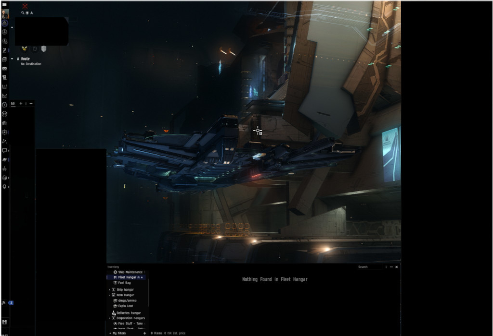
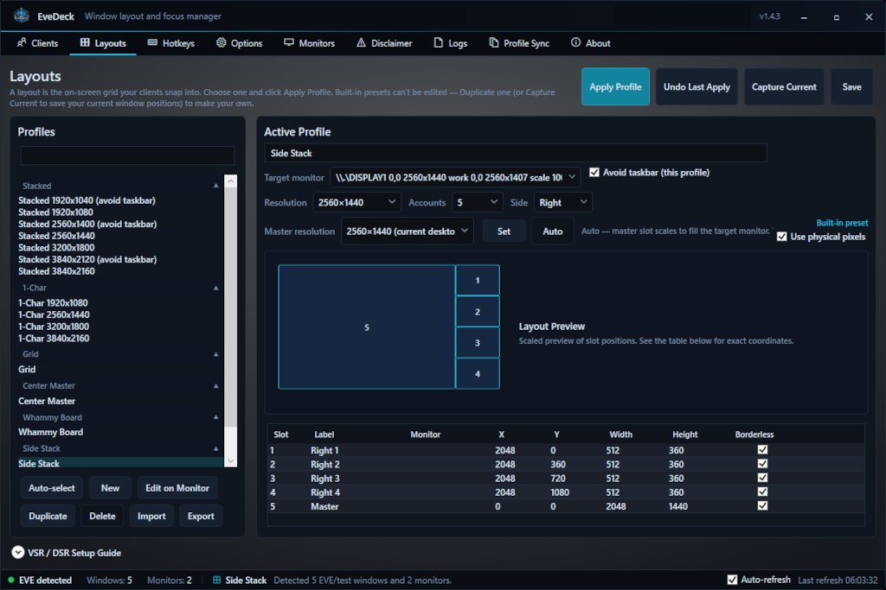
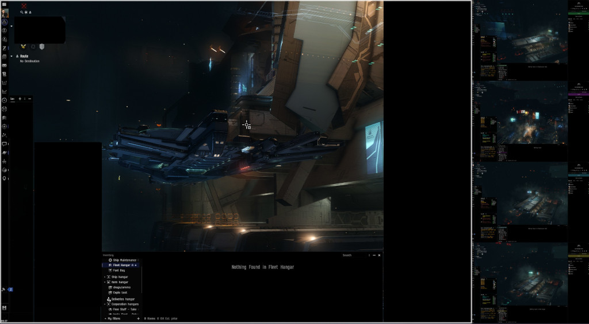
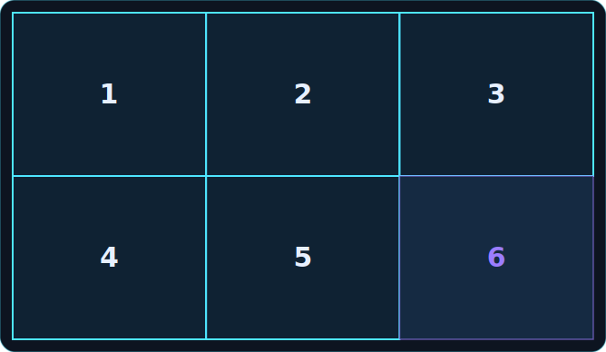
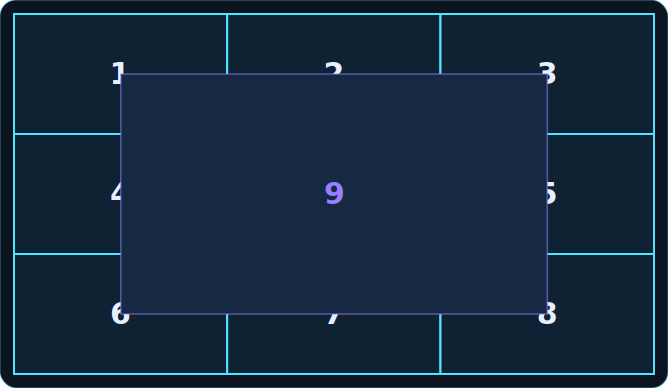
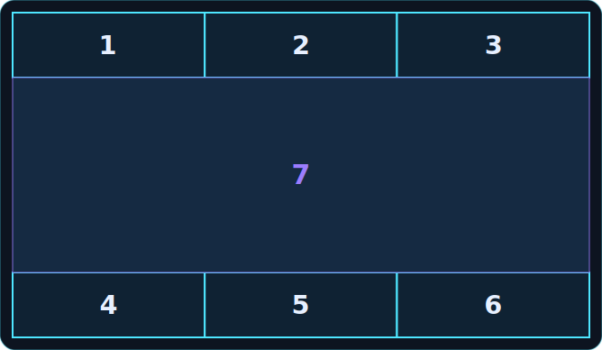
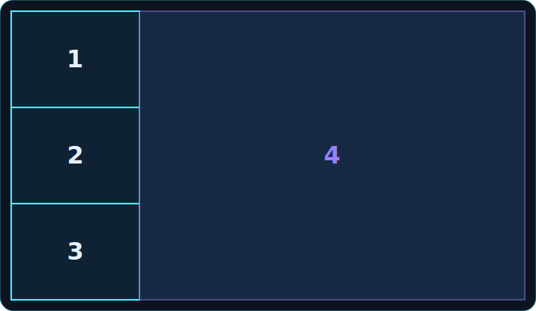
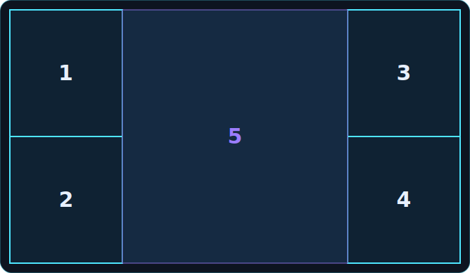

<div align="center">


# EveDeck

### Command your fleet. One window at a time.

**A free, EULA-safe window layout &amp; focus manager for EVE Online multiboxing.**<br />
Live GPU-quality previews, hotkey focus switching, and resolution-independent layout
profiles — all from a single self-contained Windows app.

[](https://github.com/objectless/EveDeck/releases/latest)
[](https://evedeck.space)
[](LICENSE)


**[⬇ Download](https://github.com/objectless/EveDeck/releases/latest)  ·  [🌐 evedeck.space](https://evedeck.space)  ·  [📖 Setup guide](https://evedeck.space/readme)**

</div>

---

## Why EveDeck?

Multiboxing EVE means wrangling a wall of clients. EveDeck arranges them into
pixel-perfect layouts, shows live previews of every background client, and lets you
throw focus to any character with a single keypress — while staying strictly inside the
EVE Online EULA. **It is a window manager only. One input, one client, always.**

<p align="center">
  
  <br />
  <sub>One client, borderless, filling its slot — no window chrome eating your view.</sub>
</p>

## Everything you need for multiboxing

🪟 **Previews &amp; peek** — live thumbnails of your background clients right in their layout
tiles, powered by Windows' own DWM thumbnail compositor (no screen capture involved). Hover
to *peek* a client into the master slot; click to swap. It reverts the moment your cursor leaves.

📐 **Layout profiles** — built-in families with resolution and account-count dropdowns:
**Grid**, **Center Master**, **Whammy Board**, **Side Stack**, **Twin Stack**, **Stacked /
1-Char / Overlap** — each targets a single monitor you pick from a dropdown. Need to span more
than one screen? Build a **custom profile**: the on-monitor WYSIWYG editor lets you drag slots
to move, drag edges to resize, snap to the grid, and place slots on *any* connected monitor —
one profile can cover your whole desktop. What you draw is exactly what you get. If a seat's
client isn't running, the next seat in line is promoted to master until it returns.

🧑‍🚀 **Character identity &amp; ESI** — character names and portraits via EVE SSO (PKCE
OAuth). Fixed seats (*Model A*): accounts keep their seat and labels never scramble —
window positions rotate, identities don't. No passwords, ever.

⌨️ **Hotkeys &amp; focus control** — global hotkeys to centre any seat, swap with the
master, focus by screen direction, or follow a named character wherever they've rotated to.
Gated mode fires keys only while EVE is the active app.

🖥️ **Desktop &amp; system** — borderless toggling, active-window frame glow, focus-aware
always-on-top pins (only topmost while EVE is foreground), tray mode, auto-apply on client
launch, one-click in-app auto-update (silent installer upgrade or self-updating portable
build), an overlay allow-list that keeps chosen companion apps like Mumble/Discord above
the corner overlays, rolling settings backups, per-profile taskbar avoidance, and background
CPU throttling for inactive clients.

🚨 **Alerts &amp; pill polish** — flash a seat and play a sound on in-game combat/aggression
events read straight from EVE's gamelog, not just chat keywords; per-seat system and offline
pills with a configurable hide timer; minimize-all and auto-minimize hotkeys with a per-seat
"never minimize" flag for scouts you always want visible; a separate font, size, and color for
the centered master pill vs. the smaller corner alt pills; a zoom-style hover preview option;
and an `evedeck://` link handler for one-click deep links from Discord or a browser.

📋 **Profile Sync** — copy one character's EVE settings to any number of alts in a click:
both per-character (`core_char`) and per-account (`core_user`) files, so window positions
and UI are truly 1:1 across every client. Originals are timestamp-backed-up first.

🎙️ **Comms overlay** — pin Mumble's Talking UI on top of your layout: drag it anywhere,
resize from any edge, lock it in place, and set its transparency. It's the real Mumble
window — fully interactive, restored untouched when you detach.

🔔 **Launch Groups &amp; Chat Alerts** — save multiple named character rosters (Character
Sets) and launch a whole fleet with staggered EVE Launcher clicks; Chat Alerts watches your
chatlogs for keywords per character and flashes the matching seat with a sound the moment
one hits.

📋 **Resolution independent** — layout slots are stored as fractional rects, so one profile
works at 1440p, 4K, or any AMD VSR / Nvidia DSR virtual resolution, with an optional
master-resolution override. EVE clients are never resized mid-session, so the in-game UI
never re-flows.

## Layouts, visualized

Every diagram below is generated straight from the same slot geometry the app computes at
runtime (see [`PresetFactory.cs`](app/src/EveDeck/Services/PresetFactory.cs)) — not mockups.
Pick a family, set a resolution and account count, and EveDeck does the math.

<table>
<tr>
<td width="50%">

<br /><sub>The <b>Layouts</b> tab — pick a family, set resolution + accounts, hit Apply.</sub>
</td>
<td width="50%">

<br /><sub><b>Side Stack</b>, 5 accounts, live in EVE — master fills the screen, alts stack down the edge.</sub>
</td>
</tr>
<tr>
<td width="50%">

<br /><sub><b>Grid</b> — evenly split tiles, any account count from 2 to 15.</sub>
</td>
<td width="50%">

<br /><sub><b>Center Master</b> — a ring of alts with the master floating centred on top.</sub>
</td>
</tr>
<tr>
<td width="50%">

<br /><sub><b>Whammy Board</b> — alts split top and bottom, master fills the gap edge to edge.</sub>
</td>
<td width="50%">

<br /><sub><b>Side Stack</b> — a column of alts down either edge, master takes the rest.</sub>
</td>
</tr>
<tr>
<td width="50%">

<br /><sub><b>Twin Stack</b> — alts stacked two per edge, master bookended in the middle.</sub>
</td>
<td width="50%"></td>
</tr>
</table>

## Up and running in minutes

**01 · Download &amp; run** — grab the [latest release](https://github.com/objectless/EveDeck/releases/latest),
unzip, and run `EveDeck.exe`. No installer, no .NET runtime — everything is bundled.

**02 · Complete the wizard** — it detects your clients, links your characters via ESI
OAuth, and picks a layout preset. Under two minutes, start to finish.

**03 · Apply &amp; multibox** — click **Apply Layout**. Your clients snap into place and
previews appear instantly. Hover to peek, click to swap, or drive your whole fleet from
the keyboard.

> **Heads up:** if EVE runs as Administrator, run EveDeck as Administrator too — otherwise
> its global hotkeys can't reach the game.

## EULA compliance

EveDeck is built to comply with the EVE Online EULA's one-input-one-client rule. It
contains **no** input broadcasting or multiplexing, no key/mouse forwarding, no gameplay
or login automation, no game-memory access, and no password storage. Every hotkey action
passes a safety guard that blocks input-forwarding behaviour by construction. See
[app/COMPLIANCE.md](app/COMPLIANCE.md) for the full boundary.

## FAQ

**Is EveDeck allowed under the EVE Online EULA?**
Yes. EveDeck only moves and styles OS windows — it never reads EVE memory, injects code,
broadcasts input across clients, or automates gameplay. One human input always controls
one client at a time.

**Do I need to install .NET or any runtime?**
No. The download is a single self-contained build; everything EveDeck needs is bundled
inside. Just extract and run.

**Does it work with multiple monitors?**
Yes, two ways. Built-in layout families (Grid, Center Master, etc.) each target a single
monitor you pick from a dropdown. For a layout that spans two or more monitors, build a
**custom profile** with the on-monitor editor — drag slots onto any connected display and
one profile drives the whole desktop; no per-monitor profile juggling.

**Can I add another display without buying a monitor?**
Yes — a phone or tablet plugged in over USB and running a screen-extension app shows up to
Windows as a normal monitor, so you can drop an extra seat or two on it like any other
display. [SuperDisplay](https://superdisplay.app/) is a popular option for this (a one-time lifetime
license runs around $15 as of writing) — it's a third-party tool, unaffiliated with EveDeck,
but works well for exactly this. Combine it with a custom multi-monitor profile (above) and
it's a one-time drag-and-drop setup.

**Windows or my antivirus flagged the download — is it safe?**
Every release is built directly from this public repo via GitHub Actions and scanned with
VirusTotal automatically — see the results on each [release page](https://evedeck.space/releases).
A single low-signal engine occasionally blacklist-flags a freshly-built, self-contained EXE;
that's a known false-positive pattern for this class of app, not a verified detection. As
with any software, downloading, installing, and running EveDeck is ultimately **at your own
risk** — EveDeck is open source, so you're always free to read the code or build it yourself
if you want certainty.

**Does it support AMD VSR / Nvidia DSR virtual resolutions?**
Yes. Slots are stored as fractional rects, so a single profile works at any resolution,
with a per-profile master-resolution override for DSR setups.

**My hotkeys aren't firing — what do I check?**
If EVE is running as Administrator, EveDeck must be too. Also make sure gated mode is
enabled on the Hotkeys tab so keys fire only when EVE is active.

## Building from source

Requirements: Windows 10 (build 19041+) and the .NET 10 SDK.

```powershell
dotnet build .\app\EveDeck.sln          # build
dotnet test  .\app\EveDeck.sln          # run the test suite

# self-contained publish (what releases ship)
dotnet publish .\app\src\EveDeck\EveDeck.csproj `
  -c Release --self-contained -r win-x64 -o .\app\publish
```

## License

EveDeck is free software under the **GNU General Public License v3.0** — see
[LICENSE](LICENSE). Copyright © 2026 EveDeck.

The **EveDeck name, logo, and icon are not covered by the GPL** and remain the exclusive
property of the EveDeck project — forks must ship under their own branding. See
[TRADEMARKS.md](TRADEMARKS.md).

EVE Online is a trademark of [Fenris Creations hf.](https://fenriscreations.com/) EveDeck is a
third-party tool, not affiliated with or endorsed by Fenris Creations.
